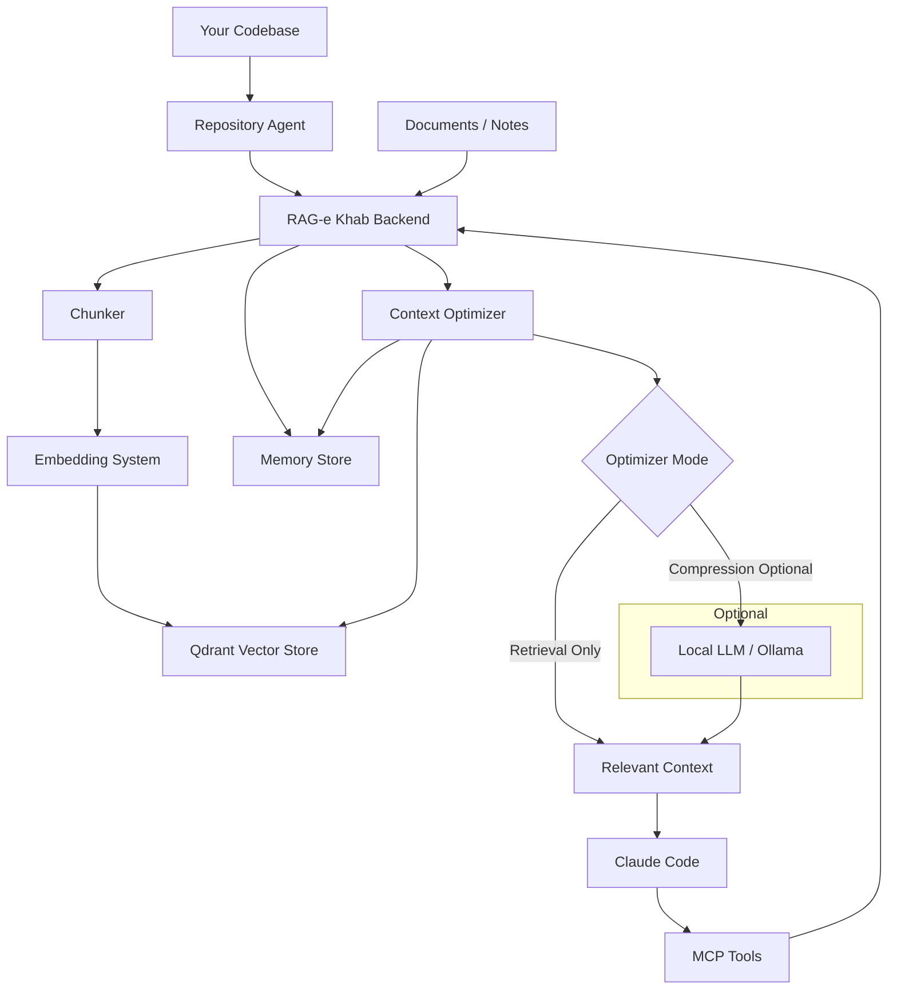

# RAG-e Khab

RAG-e Khab is a self-hosted knowledge and persistent memory system for coding agents.

It keeps the original RAG workflow for uploading, indexing, searching, and chatting with private knowledge, and adds long-term project memory plus context optimization for Claude Code, Codex, Cursor, Gemini CLI, and other MCP-compatible coding agents.



## Stack

- Kotlin, Java 25, Spring Boot 4, Gradle Kotlin DSL
- LangChain4j dependency included for the AI layer
- Qdrant service in Docker Compose
- React, TypeScript, Vite
- JSON-RPC MCP endpoint at `/mcp`

## Run

```bash
docker compose up --build
```

Then open:

- UI: `http://localhost:5173`
- REST API: `http://localhost:8060/api`
- MCP endpoint: `http://localhost:8060/mcp`
- Qdrant: `http://localhost:6333`

For local backend development:

```bash
gradle :backend:bootRun
```

For local frontend development:

```bash
cd frontend
npm install
npm run dev
```

## REST API

- `POST /api/documents` multipart upload with field `file`
- `POST /api/texts` with `{ "title": "...", "text": "...", "projectId": "..." }`
- `POST /api/projects` with `{ "name": "...", "description": "..." }`
- `GET /api/projects`
- `GET /api/projects/{id}`
- `DELETE /api/projects/{id}` deletes a non-General project, its documents, vectors, and matching repository metadata
- `GET /api/documents`, optionally with `?projectId=...`
- `GET /api/documents/{id}`
- `DELETE /api/documents/{id}`
- `POST /api/search` with `{ "query": "...", "limit": 8, "projectId": "..." }`
- `POST /api/chat` with `{ "question": "...", "limit": 8, "projectId": "..." }`
- `POST /api/reindex`
- `GET /api/admin/status`
- `POST /api/context/optimize`
- `POST /api/repository-agent/scan`
- `GET /api/repository-agent/status`
- `POST /api/memories`
- `POST /api/memories/recall`
- `GET /api/memories`
- `DELETE /api/memories/{id}`

## Persistent Memory

Agents lose project knowledge between sessions. RAG-e Khab stores structured memories so agents can recall architecture decisions, coding conventions, bug fixes, project knowledge, domain knowledge, technical debt, and reusable patterns before exploring a codebase.

Supported memory types:

- `ArchitectureDecision`
- `CodingConvention`
- `BugFix`
- `ProjectKnowledge`
- `DomainKnowledge`
- `TechnicalDebt`
- `Pattern`

The memory layer sits on top of the existing RAG foundation:

1. `remember` stores a first-class structured memory.
2. The memory is persisted to `agent-memories.json` under the configured storage directory.
3. The memory is indexed into the existing vector index as a special memory chunk.
4. `recall_memory` retrieves relevant memories for a coding task.
5. Ranking combines vector relevance, confidence, usage frequency, and recency.
6. Retrieved memories update their usage count and last access timestamp.

Example memory:

```json
{
  "type": "ArchitectureDecision",
  "content": "Authentication is implemented using JwtAuthenticationFilter.",
  "confidence": 0.9
}
```

## Repository Agent

The Repository Agent keeps RAG-e Khab synchronized with a codebase and is intended to become the primary mechanism for keeping the knowledge base current.

Preferred architecture:

```text
Repository
-> ragekhab-agent.jar
-> RAG-e Khab /api/repository-agent/sync
-> Existing Chunker / DocumentRepository / VectorIndex
-> Qdrant
```

The recommended agent is a standalone JAR that you run inside each repository. It discovers source files locally and sends a Claude-oriented repository context to RAG-e Khab over HTTP, so the backend does not need Docker access to your host filesystem.

By default, the JAR does not upload every source file. It sends:

- repository structure
- module summaries
- source declaration index
- README, AGENTS.md, CLAUDE.md, and docs
- build/test/deployment config
- conventions and best-practice files when present

The backend converts those pushed context artifacts into normal `KnowledgeDocument` entries, chunks them with the existing `Chunker`, and upserts or deletes vectors through the existing `VectorIndex`.

Supported files include source code, Markdown, `README.md`, `AGENTS.md`, and `CLAUDE.md`. Ignored directories include `.git`, `.gradle`, `node_modules`, `build`, `dist`, `target`, `out`, coverage, and common editor/cache folders.

Stored metadata includes repository root, relative file path, module, language, last modified date, size, content hash, indexed date, and deleted status.

Build the agent JAR:

```bash
gradle :agent:jar
```

Run it from any repository:

```bash
java -jar /path/to/RAGEKHAB/agent/build/libs/ragekhab-agent.jar \
  --server http://localhost:8060 \
  --repository billing-api \
  --path .
```

Run it for several repositories:

```bash
java -jar /path/to/ragekhab-agent.jar --server http://localhost:8060 --repository billing-api --path /repos/billing-api
java -jar /path/to/ragekhab-agent.jar --server http://localhost:8060 --repository admin-ui --path /repos/admin-ui
java -jar /path/to/ragekhab-agent.jar --server http://localhost:8060 --repository mobile-app --path /repos/mobile-app
```

Useful options:

```text
--profile claude|source   claude sends compact repo intelligence. source sends all files. Default: claude
--include-source true     Alias for --profile source
--full true|false         Delete files that disappeared from the repo when true. Default: true
--dry-run                 Show discovered files without sending them
--max-batch-bytes N       Approximate HTTP sync batch size
--max-file-bytes N        Skip very large files
```

Only use full source sync when you intentionally want RAG-e Khab to store the code content:

```bash
java -jar /path/to/ragekhab-agent.jar \
  --server http://localhost:8060 \
  --repository billing-api \
  --path /repos/billing-api \
  --profile source
```

Server-side scanning is still available for mounted paths or local backend development. Configure the repository path:

```bash
RAGEKHAB_REPOSITORY_PATH=/path/to/repository
RAGEKHAB_REPOSITORY_SCHEDULED=false
RAGEKHAB_REPOSITORY_SCAN_INTERVAL_MS=300000
```

Manual scan over the configured path:

```http
POST /api/repository-agent/scan
{}
```

Manual scan over an explicit path:

```json
{
  "repository": "ragekhab",
  "path": "/path/to/repository",
  "full": false
}
```

Each scan or agent sync can target a different repository. `repository` is the stable name agents should use later with `optimize_context`, `recall_memory`, or `repository_status`. If `repository` is omitted for server-side scans, the folder name is used.

Examples:

```bash
curl -X POST http://localhost:8060/api/repository-agent/scan \
  -H "Content-Type: application/json" \
  -d '{"repository":"billing-api","path":"/repos/billing-api","full":true}'

curl -X POST http://localhost:8060/api/repository-agent/scan \
  -H "Content-Type: application/json" \
  -d '{"repository":"admin-ui","path":"/repos/admin-ui","full":true}'
```

The agent JAR sends the equivalent payload to:

```http
POST /api/repository-agent/sync
```

Repository status for all repos:

```http
GET /api/repository-agent/status
```

Repository status for one repo:

```http
GET /api/repository-agent/status?repository=billing-api
```

`full: true` re-indexes all discovered files. `full: false` performs an incremental scan and indexes only new or changed files while removing deleted files from the vector index.

## Context Optimizer

The Context Optimizer minimizes retrieved repository knowledge into a compact task-specific payload for coding agents.

Pipeline:

1. Retrieve candidate chunks from the active project.
2. Remove near-duplicate chunks by normalized content fingerprint.
3. Score candidate value with vector score, task-term overlap, source/path signals, and density penalties.
4. Drop low-value candidates and select the smallest useful set within a target token budget.
5. In retrieval mode, return selected context directly without any local LLM.
6. In compression mode, optionally ask a configured local LLM to compress selected chunks.
7. If local LLM is disabled or unavailable, fall back to retrieval-only output.
8. Return source filenames, estimated token usage, and a token savings report.

Retrieval-only mode:

```yaml
ragekhab:
  optimizer:
    mode: retrieval
    max-tokens: 3000
  local-llm:
    enabled: false
```

Compression mode:

```yaml
ragekhab:
  optimizer:
    mode: compression
    max-tokens: 3000
  local-llm:
    enabled: true
    provider: ollama
    base-url: http://localhost:11434
    model: qwen2.5:7b
  embedding:
    provider: hash
    model: nomic-embed-text
    base-url: http://host.docker.internal:11434
    dimensions: 384
```

Environment variables:

```bash
RAGEKHAB_OPTIMIZER_MODE=retrieval
RAGEKHAB_OPTIMIZER_MAX_TOKENS=3000
RAGEKHAB_LOCAL_LLM_ENABLED=false
RAGEKHAB_LOCAL_LLM_PROVIDER=ollama
RAGEKHAB_LOCAL_LLM_BASE_URL=http://localhost:11434
RAGEKHAB_LOCAL_LLM_MODEL=qwen2.5:7b
RAGEKHAB_EMBEDDING_PROVIDER=hash
RAGEKHAB_EMBEDDING_MODEL=nomic-embed-text
RAGEKHAB_EMBEDDING_BASE_URL=http://host.docker.internal:11434
RAGEKHAB_EMBEDDING_DIMENSIONS=384
```

The same runtime settings are configurable from the Admin panel at `/admin`:

- Chat provider, model, base URL, and API key
- Optimizer mode and max token budget
- Local LLM compression toggle, provider, base URL, and model
- Embedding provider, model, base URL, and dimensions
- Repository Agent path, scheduled scan toggle, and scan interval

Panel changes are persisted to `runtime-settings.json` in the configured storage directory and apply to future requests without rebuilding the app.

## MCP Tools

The MCP JSON-RPC endpoint supports:

- `search_documents`
- `ask_knowledge_base`
- `create_project`
- `list_projects`
- `add_text`
- `list_documents`
- `get_document`
- `delete_document`
- `optimize_context`
- `remember`
- `recall_memory`
- `list_memories`
- `delete_memory`
- `learn_from_session`
- `scan_repository`
- `repository_status`

### `optimize_context`

Input:

```json
{
  "task": "Add pagination to Orders API",
  "maxTokens": 2000,
  "repository": "backend",
  "module": "orders"
}
```

`repository` and `module` are optional. `projectId` and `targetTokens` are still accepted for compatibility.

Output:

```json
{
  "summary": "Most relevant context for 'Add pagination to Orders API' is concentrated in OrdersController.kt; 4 source(s) selected for Claude Code.",
  "criticalContext": [
    "OrdersController.kt: OrdersController already exposes filtering endpoints.",
    "PaginationRequest.kt: PaginationRequest defines page, size, and sort query fields."
  ],
  "importantContext": [
    "CustomerController.kt: Customer API uses PaginationRequest for list endpoints."
  ],
  "optionalContext": [
    "api-standards.md: List endpoints should expose page,size,sort query parameters."
  ],
  "sources": [
    "OrdersController.kt",
    "PaginationRequest.kt",
    "CustomerController.kt"
  ],
  "estimatedTokens": 420,
  "tokenSavings": {
    "candidateTokens": 11800,
    "optimizedTokens": 420,
    "savedTokens": 11380,
    "savingsPercent": 96.4,
    "maxTokens": 2000
  },
  "cacheHit": false,
  "compression": "retrieval-only"
}
```

In compression mode with `local-llm.enabled=true`, `compression` is `local-llm:ollama` when the local model succeeds. If the local model is disabled or unavailable, `compression` is `retrieval-fallback` and the MCP tool still returns useful retrieved context.

### `remember`

Input:

```json
{
  "type": "ArchitectureDecision",
  "content": "Authentication uses JwtAuthenticationFilter.",
  "confidence": 0.9,
  "repository": "backend",
  "module": "auth"
}
```

### `recall_memory`

Input:

```json
{
  "task": "Add SSO support",
  "limit": 8,
  "repository": "backend",
  "module": "auth"
}
```

Output:

```json
{
  "relevantMemories": [
    {
      "id": "memory-id",
      "type": "ArchitectureDecision",
      "content": "Authentication uses JwtAuthenticationFilter.",
      "relevanceScore": 0.8421,
      "confidenceScore": 0.9,
      "createdAt": "2026-06-16T12:00:00Z",
      "usageCount": 3,
      "lastAccessedAt": "2026-06-16T14:00:00Z",
      "repository": "backend",
      "module": "auth"
    }
  ]
}
```

### `list_memories`

Returns all stored memories.

### `delete_memory`

Input:

```json
{
  "id": "memory-id"
}
```

### `learn_from_session`

Reserved for a future release. It will analyze completed work and extract architecture decisions, coding conventions, bug fixes, and reusable patterns.

## Provider Configuration

The backend selects an LLM provider through environment variables:

```bash
RAGEKHAB_LLM_PROVIDER=ollama
RAGEKHAB_LLM_MODEL=llama3.1
RAGEKHAB_LLM_BASE_URL=http://localhost:11434
RAGEKHAB_LLM_API_KEY=
```

Provider implementations are isolated behind `LLMProvider`, so business services use the abstraction only. LangChain4j is used at the model plumbing boundary for local Ollama chat/compression calls, while RAG-e Khab keeps memory ranking, repository sync, context optimization, token budgeting, and MCP behavior in custom services. The current scaffold includes `ollama`, `openai`, `claude`, and `gemini` provider beans; non-configured remote providers retain an extractive fallback so the app remains useful without credentials.

## Embedding Configuration

RAG-e Khab supports two embedding providers:

- `hash`: the existing provider-free `TextEmbedder`, using a 384-dimensional hash-based bag-of-words vector.
- `ollama`: calls Ollama's embeddings API with the configured model, defaulting to `nomic-embed-text`.

Default:

```yaml
ragekhab:
  embedding:
    provider: hash
    model: nomic-embed-text
    base-url: http://host.docker.internal:11434
    dimensions: 384
```

For Ollama:

```bash
ollama pull nomic-embed-text
RAGEKHAB_EMBEDDING_PROVIDER=ollama
RAGEKHAB_EMBEDDING_MODEL=nomic-embed-text
RAGEKHAB_EMBEDDING_BASE_URL=http://host.docker.internal:11434
```

Ollama embedding dimensions are detected from the model output. If Ollama is unavailable, indexing and search fail clearly instead of silently mixing vector spaces.

Migration note: Qdrant collections have a fixed vector size. Existing vectors created with the hash provider use 384 dimensions. If you switch to Ollama and the model returns a different dimension, RAG-e Khab recreates the Qdrant collection with the active dimension. Run `POST /api/reindex` or re-sync repositories afterward so documents are embedded with the new provider. The in-memory fallback also ignores vectors created with a different active embedding signature.

## Notes

The vector index writes to Qdrant when it is available and keeps an in-memory fallback so local development still works if Qdrant is offline.
