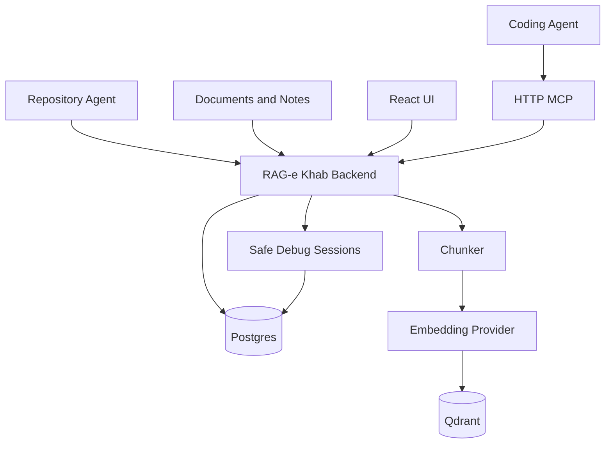

# RAG-e Khab

RAG-e Khab is a self-hosted memory, knowledge, and safe-debug workspace for AI coding agents.

It gives agents a smaller, safer way to work with your projects:

- store durable project memories and conventions
- index private notes, documents, and compact repository context
- retrieve task-focused context instead of dumping whole repositories into chat
- sanitize production-like debugging data before sharing it with an agent
- expose the workflow through a UI, REST API, and HTTP MCP server

RAG-e Khab is designed for Codex, Claude Code, Cursor, Gemini CLI, and other MCP-compatible coding agents.

## Features

- **Knowledge base**: upload files, add text notes, search, and chat with cited sources.
- **Project memory**: store architecture decisions, conventions, bug fixes, patterns, domain knowledge, and technical debt.
- **Repository agent**: sync compact repository maps, module summaries, selected docs, build config, and source declarations.
- **Context optimizer**: retrieve and trim task-specific context within a token budget.
- **Context packages**: return class summaries, dependency chains, related tests, snippets, and selection reasons.
- **Safe Debug Sessions**: sanitize CSV, JSON, and logs before sharing production-like data with agents.
- **MCP tools**: expose memory, search, context, repository, and Safe Debug workflows to coding agents.

## Architecture



Key decisions are documented in [Architecture Decision Records](docs/adr/README.md).

## Stack

- Kotlin, Java 25, Spring Boot 4
- PostgreSQL for durable app state
- Qdrant for vector search
- Hash-based local embeddings by default, optional Ollama embeddings
- Optional local LLM compression through Ollama
- React, TypeScript, Vite, Mantine
- JSON-RPC MCP over HTTP at `/mcp`

## Quick Start

Start everything with Docker Compose:

```bash
docker compose up --build
```

Open:

- UI: `http://localhost:5173`
- REST API: `http://localhost:8060/api`
- Swagger UI: `http://localhost:8060/swagger-ui.html`
- OpenAPI JSON: `http://localhost:8060/v3/api-docs/rest-api`
- MCP endpoint: `http://localhost:8060/mcp`
- Qdrant dashboard: `http://localhost:6333/dashboard`
- Postgres: `localhost:5433`

The default database port is `5433` to avoid clashing with a local Postgres on `5432`.

## Local Development

Start only the backing services:

```bash
docker compose up -d postgres qdrant
```

Run the backend:

```bash
gradle :backend:bootRun
```

Run the frontend:

```bash
cd frontend
npm install
npm run dev
```

Build and test:

```bash
gradle :backend:test
gradle :agent:build
cd frontend
npm run build
```

## Repository Agent

The repository agent is a standalone JAR that runs inside a repository and pushes compact coding-agent context to RAG-e Khab.

It does not upload every source file. It sends:

- repository structure
- module summaries
- source declaration index
- README, AGENTS.md, and docs
- build, test, and deployment config
- convention and best-practice files when present

Build the agent:

```bash
gradle :agent:jar
```

Open the desktop UI:

```bash
java -jar agent/build/libs/ragekhab-agent.jar
```

Run from a repository:

```bash
java -jar /path/to/ragekhab-agent.jar \
  --server http://localhost:8060 \
  --repository billing-api \
  --path .
```

Useful options:

```text
--repository NAME         Stable repository name. Default: scanned folder name
--path PATH               Repository path to scan. Default: current directory
--full true|false         Delete files that disappeared from the repo when true. Default: true
--dry-run                 Show discovered context artifacts without sending them
--max-batch-bytes N       Approximate HTTP sync batch size
--max-file-bytes N        Skip very large files
```

`--profile claude`, `--profile compact`, and `--profile agent` are accepted as compatibility aliases. Compact agent context is always used.

## MCP Setup

RAG-e Khab exposes HTTP MCP at:

```text
http://localhost:8060/mcp
```

Example MCP config:

```json
{
  "mcpServers": {
    "rag-e-khab": {
      "type": "http",
      "url": "http://localhost:8060/mcp"
    }
  }
}
```

Recommended agent flow:

1. Call `repository_status` to find the indexed repository name.
2. Call `recall_memory` for the current task.
3. Call `build_context_package` or `optimize_context` before reading many files.
4. Use `search_documents` when extra indexed knowledge is needed.
5. Store only developer-approved, sanitized lessons with `remember`.

Important tools:

| Tool | Purpose |
| --- | --- |
| `repository_status` | List synced repositories and file counts. |
| `recall_memory` | Retrieve durable project memories for a task. |
| `build_context_package` | Build compact task-focused repo context with summaries, dependency chains, tests, snippets, and debug reasons. |
| `optimize_context` | Retrieve and trim relevant context within a token budget. |
| `search_documents` | Semantic search over indexed documents and repository context. |
| `remember` | Store a structured long-term memory. |
| `list_memories` | List durable memories. |
| `list_debug_sessions` | List Safe Debug Sessions. |
| `get_debug_session_state` | Inspect sanitized debug artifacts and request state. |
| `create_debug_data_request` | Ask the developer for more sanitized follow-up data. |
| `record_agent_request` | Record a free-form Safe Debug follow-up request. |

Agents should not request raw production data, token maps, emails, phone numbers, addresses, raw SQL output, or raw database rows.

## Safe Debug Sessions

Safe Debug Sessions are temporary workspaces for production-like investigations.

The developer can paste CSV, JSON, or logs locally. RAG-e Khab sanitizes the data and stores only the sanitized artifact for agent use. Real values remain local and are resolved privately in the UI.

Sanitizer modes:

- **Balanced**: default mode. Masks high-confidence PII and secrets while preserving useful structure.
- **Strict**: adds lower-confidence values such as UUID-like values, IP addresses, and birth-date-like values.
- **Permissive**: masks high-confidence values but only warns about lower-confidence names and addresses.

Typical workflow:

1. Create a Safe Debug Session.
2. Paste query output as CSV, JSON, or logs.
3. Sanitize it.
4. Share the sanitized artifact with the coding agent.
5. The agent requests more data with `create_debug_data_request`.
6. The developer runs private follow-up queries and links a new sanitized artifact.
7. Reusable sanitized lessons can be promoted to Memory.

## Configuration

Most settings can be configured with environment variables:

```bash
RAGEKHAB_LLM_PROVIDER=ollama
RAGEKHAB_LLM_MODEL=llama3.1
RAGEKHAB_LLM_BASE_URL=http://host.docker.internal:11434
RAGEKHAB_OPTIMIZER_MODE=retrieval
RAGEKHAB_OPTIMIZER_MAX_TOKENS=3000
RAGEKHAB_LOCAL_LLM_ENABLED=false
RAGEKHAB_EMBEDDING_PROVIDER=hash
RAGEKHAB_EMBEDDING_DIMENSIONS=384
QDRANT_URL=http://qdrant:6333
POSTGRES_PORT=5433
```

Runtime settings for chat, embeddings, optimizer mode, and local LLM compression are also available in the Settings UI.

## Project Structure

```text
agent/       Standalone repository sync agent
backend/     Spring Boot API, MCP server, persistence, indexing, memory, Safe Debug
frontend/    React UI
docs/adr/    Architecture Decision Records
docs/        Examples and supporting docs
docker/      Nginx config for the frontend container
```

## Notes

- Qdrant is the primary vector store. The backend has a lightweight in-memory fallback for local development and transient Qdrant failures.
- The default embedding provider is deterministic and local. Ollama embeddings can be enabled when semantic quality matters more than zero-dependency setup.
- Full raw-source repository indexing is intentionally not exposed in the agent UI. Use local file reads for exact implementation edits.
