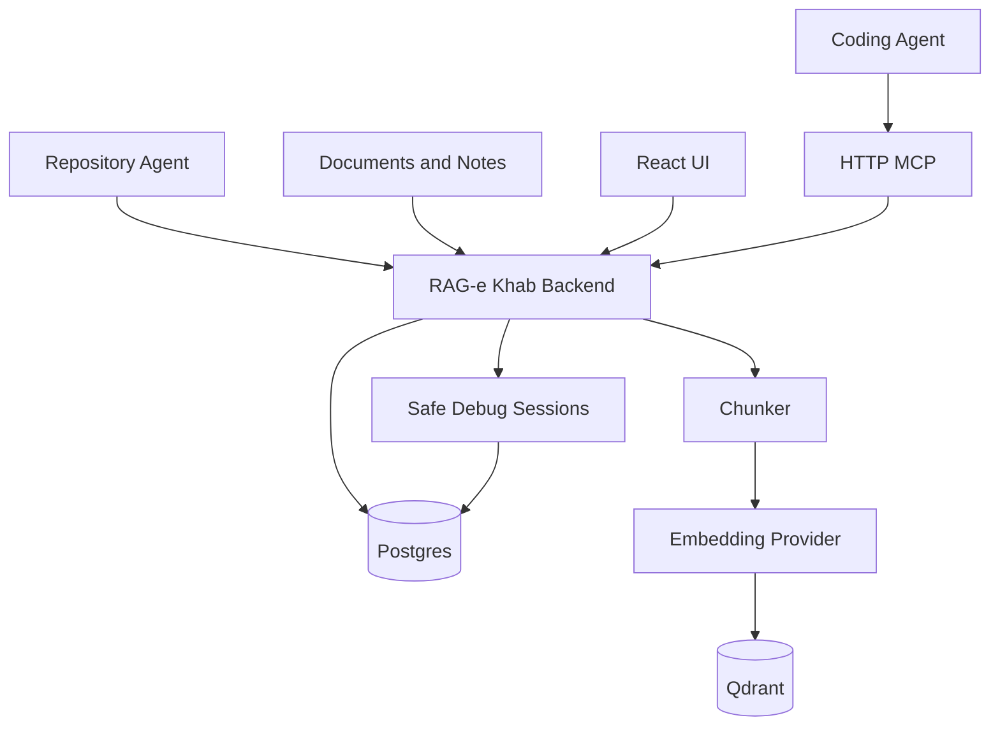

# RAG-e Khab

RAG-e Khab is a self-hosted memory, knowledge, and safe-debug workspace for AI coding agents.

It gives agents a smaller, safer way to work with your projects:

- store durable project memories and conventions
- index private notes, documents, and coding-focused repository context
- retrieve task-focused context instead of dumping whole repositories into chat
- sanitize production-like debugging data before sharing it with an agent
- expose the workflow through a UI, REST API, and HTTP MCP server

RAG-e Khab is designed for Codex, Claude Code, Cursor, Gemini CLI, and other MCP-compatible coding agents.

## Features

- **Knowledge base**: upload PDFs, Word documents, slide decks, spreadsheets, HTML, Markdown, and text notes; search and chat with cited sources.
- **Workspace health**: see whether a workspace has enough sources, memories, fresh repository context, and current guidance for coding agents.
- **Project memory**: store architecture decisions, conventions, bug fixes, patterns, domain knowledge, and technical debt.
- **Stale memory detection**: flag repository-scoped memories when related indexed files changed after the memory was saved.
- **Repository agent**: sync source files for exact coding context plus compact repository maps, module summaries, selected docs, and build configuration.
- **Context optimizer**: retrieve and trim task-specific context within a token budget.
- **Budget profiles**: choose small, standard, or deep context budgets without hand-tuning token counts.
- **Context preview**: show selected sources, token estimates, and selection reasons before using optimized context.
- **Task templates**: start common coding workflows such as bug fixes, endpoints, UI changes, refactors, and Safe Debug investigations from preset prompts and budgets.
- **Agent activity timeline**: inspect recent MCP tool usage without storing raw prompts or sensitive payloads.
- **Context packages**: return class summaries, dependency chains, related tests, snippets, and selection reasons.
- **Safe Debug Sessions**: sanitize CSV, JSON, and logs, compare sanitized artifacts, then compact noisy context before sharing it with agents.
- **Memory suggestions**: propose editable sanitized lessons from Safe Debug sessions before saving durable memory.
- **Artifact compression**: store raw developer artifacts locally while indexing compact summaries for retrieval.
- **MCP tools**: expose memory, search, context, repository, artifact expansion, and Safe Debug workflows to coding agents.

## Architecture



Key decisions are documented in [Architecture Decision Records](docs/adr/README.md).

## Stack

- Kotlin, Java 25, Spring Boot 4
- PostgreSQL for durable app state
- Qdrant for vector search
- Hash-based local embeddings by default, optional Ollama embeddings
- Optional local LLM compression through Ollama
- React, TypeScript, Vite, Mantine
- JSON-RPC MCP over HTTP at `/mcp`

## Quick Start

Start everything with Docker Compose:

```bash
docker compose up --build
```

Open:

- UI: `http://localhost:5173`
- REST API: `http://localhost:8060/api`
- Swagger UI: `http://localhost:8060/swagger-ui.html`
- OpenAPI JSON: `http://localhost:8060/v3/api-docs/rest-api`
- MCP endpoint: `http://localhost:8060/mcp`
- Qdrant dashboard: `http://localhost:6333/dashboard`
- Postgres: `localhost:5433`

The default database port is `5433` to avoid clashing with a local Postgres on `5432`.

## Local Development

Start only the backing services:

```bash
docker compose up -d postgres qdrant
```

Run the backend:

```bash
gradle :backend:bootRun
```

Run the frontend:

```bash
cd frontend
npm install
npm run dev
```

Build and test:

```bash
gradle :backend:test
gradle :agent:build
cd frontend
npm run build
```

## Repository Agent

The repository agent is a standalone JAR that runs inside a repository and pushes focused coding context to RAG-e Khab. It combines compact orientation artifacts with declaration-centered implementation excerpts for every source file.

It does not upload every source file. It sends:

- repository structure
- module summaries
- source declaration index
- README, AGENTS.md, and docs
- build, test, and deployment config
- convention and best-practice files when present

Build the agent:

```bash
gradle :agent:jar
```

Open the desktop UI:

```bash
java -jar agent/build/libs/ragekhab-agent.jar
```

Run from a repository:

```bash
java -jar /path/to/ragekhab-agent.jar \
  --server http://localhost:8060 \
  --path .
```

Useful options:

```text
--path PATH               Repository path to scan. Default: current directory
--full true|false         Delete files that disappeared from the repo when true. Default: true
--dry-run                 Show discovered context artifacts without sending them
--max-batch-bytes N       Approximate HTTP sync batch size
--max-file-bytes N        Skip very large files
```

The sync strategy is intentionally fixed: there is no profile option and no full raw-source upload mode.

Language support:

- Indexed repository knowledge: Kotlin, Java, JavaScript, TypeScript, Python, Go, Rust, Ruby, PHP, C#, C/C++, Swift, Scala, SQL, YAML, JSON, XML, Markdown, README.md, AGENTS.md, and CLAUDE.md.
- Deeper symbol summaries: Tree-sitter parses Java, Kotlin, JavaScript, TypeScript, Python, Go, Rust, Ruby, PHP, C#, C/C++, Swift, and Scala to extract class/function summaries and source-snippet ranges.
- Fallback text patterns are used only when a parser is unavailable or cannot load.
- Raw source is still returned only when explicitly requested through source-snippet context.

## MCP Setup

RAG-e Khab exposes HTTP MCP at:

```text
http://localhost:8060/mcp
```

Example MCP config:

```json
{
  "mcpServers": {
    "rag-e-khab": {
      "type": "http",
      "url": "http://localhost:8060/mcp"
    }
  }
}
```

Recommended agent flow:

1. Call `repository_status` to find the indexed repository name.
2. Call `recall_memory` for the current task.
3. Call `build_context_package` or `optimize_context` before reading many files.
4. Use `search_documents` when extra indexed knowledge is needed.
5. Store only developer-approved, sanitized lessons with `remember`.

Important tools:

| Tool | Purpose |
| --- | --- |
| `repository_status` | List synced repositories and file counts. |
| `recall_memory` | Retrieve durable project memories for a task. |
| `build_context_package` | Build compact task-focused repo context with summaries, dependency chains, tests, snippets, and debug reasons. |
| `optimize_context` | Retrieve and trim relevant context within a token budget. |
| `search_documents` | Semantic search over indexed documents and repository context. |
| `remember` | Store a structured long-term memory. Requires `projectId`, unless `global=true` is explicitly intended. |
| `list_memories` | List durable memories. |
| `list_debug_sessions` | List Safe Debug Sessions. |
| `get_debug_session_state` | Inspect compact sanitized debug artifacts and request state. |
| `get_debug_artifact_slice` | Expand a small sanitized raw line range from a debug artifact. |
| `create_debug_data_request` | Ask the developer for more sanitized follow-up data. |
| `record_agent_request` | Record a free-form Safe Debug follow-up request. |
| `add_artifact` | Store a raw developer artifact and index a compressed representation. |
| `get_raw_artifact` | Explicitly expand a raw artifact by id. |
| `get_artifact_slice` | Explicitly expand a raw artifact line slice. |

Agents should not request raw production data, token maps, emails, phone numbers, addresses, raw SQL output, or raw database rows.

Agent-facing MCP tool calls are recorded in an activity timeline. The timeline stores tool name, status, timestamp, and a short safe summary so developers can see what agents did without persisting raw arguments or sensitive data.

## Safe Debug Sessions

Safe Debug Sessions are temporary workspaces for production-like investigations.

The developer can paste CSV, JSON, or logs locally. RAG-e Khab sanitizes the data, stores the full sanitized artifact, and compacts the agent-facing version. Real values remain local and are resolved privately in the UI.

For large pasted logs, agents receive compact context by default. The compactor keeps failures, exception classes, stack frames, file paths, method/class names, sanitized IDs, and relevant rows. It removes or summarizes repeated success lines, timestamps, duplicated logs, progress noise, and bulky low-signal output.

When compact debug context is not enough, agents can request a small sanitized raw line range with `get_debug_artifact_slice`. This expands sanitized data only, not original production values.

Safe Debug also suggests reusable memory candidates from completed data requests, agent follow-up notes, and sanitized failure signals. Suggestions are editable and must pass the same memory-promotion safety checks as manually written lessons before they can be saved.

Safe Debug can compare two sanitized artifacts in the same session. This helps spot changed rows, new errors, removed log lines, and repeated unchanged lines without exposing raw production values.

Sanitizer modes:

- **Balanced**: default mode. Masks high-confidence PII and secrets while preserving useful structure.
- **Strict**: adds lower-confidence values such as UUID-like values, IP addresses, and birth-date-like values.
- **Permissive**: masks high-confidence values but only warns about lower-confidence names and addresses.

Sanitization is profile-driven. RAG-e Khab ships built-in Strict, Balanced, and Developer-friendly profiles, then applies optional project, session, and per-artifact overrides on top. Rules can keep, remove, redact, tokenize, hash, truncate, generalize, or warn for matching fields. Matching is deterministic: explicit artifact rules, session rules, project rules, built-in rules, value detectors, then the profile's unknown-field behavior.

Some built-in rules are hard-blocked. Passwords, access tokens, private keys, card security codes, cookies, API keys, and related secret fields cannot be exposed through MCP even if an override tries to keep them. Agent-facing artifacts include safe metadata only: the effective profile name, action counts, detector/rule explanations, and sanitized content. They never include raw values, token maps, real IDs, private previews, or rejected raw artifacts.

Typical workflow:

1. Create a Safe Debug Session.
2. Paste query output as CSV, JSON, or logs.
3. Sanitize it.
4. Share the compact sanitized artifact with the coding agent.
5. The agent requests more data with `create_debug_data_request`.
6. The agent requests small sanitized raw slices with `get_debug_artifact_slice` only when compact context is insufficient.
7. The developer runs private follow-up queries and links a new sanitized artifact.
8. Reusable sanitized lessons can be promoted to Memory.

## Memory Freshness

Repository-scoped memories include a freshness signal. When indexed files in the same repository and module changed after a memory was saved, the Memories page marks it for review and shows the related changed file paths.

Global memories are not marked stale because they are not tied to a repository snapshot. The signal is computed at read time from repository metadata, so existing memories remain compatible.

Memory scope is explicit. Creating memory requires either a workspace `projectId` or `global=true`; this prevents accidental saves into the General workspace when an agent or API caller forgets the active workspace.

## Workspace Health

The dashboard shows a workspace health score from 0 to 100. It combines:

- indexed source units
- durable memories
- linked repositories with recent syncs
- stale memory count

Health is an advisory readiness signal for agents. `ready` means the workspace has useful current context. `review` means the workspace is usable but some context may be stale or incomplete. `setup` means the workspace needs more sources, memories, or repository links.

## Configuration

Most settings can be configured with environment variables:

```bash
RAGEKHAB_LLM_PROVIDER=ollama
RAGEKHAB_LLM_MODEL=llama3.1
RAGEKHAB_LLM_BASE_URL=http://host.docker.internal:11434
RAGEKHAB_OPTIMIZER_MODE=retrieval
RAGEKHAB_OPTIMIZER_MAX_TOKENS=3000
RAGEKHAB_LOCAL_LLM_ENABLED=false
RAGEKHAB_EMBEDDING_PROVIDER=hash
RAGEKHAB_EMBEDDING_DIMENSIONS=384
QDRANT_URL=http://qdrant:6333
POSTGRES_PORT=5433
```

Runtime settings for chat, embeddings, optimizer mode, and local LLM compression are also available in the Settings UI.

The optimizer token budget can be changed globally in Settings or overridden per run on the Context Optimizer page. API and MCP callers can pass `budgetProfile` (`small`, `standard`, or `deep`) or `maxTokens` for a request-specific budget. Explicit `maxTokens` always wins.

Optimizer responses include a context preview with selected sources, selection reasons, relevance score, estimated tokens, and whether the source is compressed artifact context. The UI shows this preview so developers can inspect what an agent would receive before relying on it.

The Context Optimizer page also includes task templates. Templates fill in a starting task prompt and a suggested budget profile, but the developer can edit both before running optimization.

## Project Structure

```text
agent/       Standalone repository sync agent
backend/     Spring Boot API, MCP server, persistence, indexing, memory, Safe Debug
frontend/    React UI and extracted feature components
docs/adr/    Architecture Decision Records
docs/        Examples and supporting docs
docker/      Nginx config for the frontend container
```

## Notes

- Qdrant is the primary vector store. The backend has a lightweight in-memory fallback for local development and transient Qdrant failures.
- The default embedding provider is deterministic and local. Ollama embeddings can be enabled when semantic quality matters more than zero-dependency setup.
- Full raw-source repository indexing is intentionally not exposed in the agent UI. Use local file reads for exact implementation edits.
