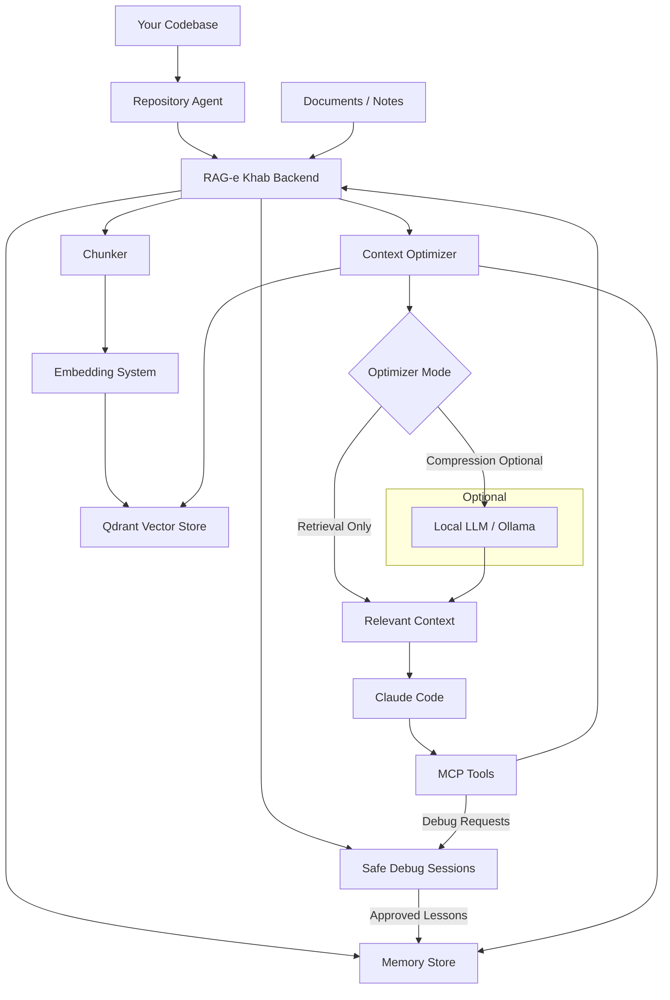

# RAG-e Khab

RAG-e Khab is a self-hosted knowledge and persistent memory system for coding agents.

It keeps the original RAG workflow for uploading, indexing, searching, and chatting with private knowledge, and adds long-term project memory plus context optimization for Claude Code, Codex, Cursor, Gemini CLI, and other MCP-compatible coding agents.



## Stack

- Kotlin, Java 25, Spring Boot 4, Gradle Kotlin DSL
- LangChain4j dependency included for the AI layer
- Qdrant service in Docker Compose
- React, TypeScript, Vite
- JSON-RPC MCP endpoint at `/mcp`

## Features

- Private RAG workspace for uploading documents, adding notes, searching, and chatting with cited sources.
- Project-aware knowledge organization with linkable repositories and memories.
- Repository Agent for syncing local codebases into the knowledge base.
- Persistent coding-agent memory for architecture decisions, conventions, bug fixes, patterns, project knowledge, domain knowledge, and technical debt.
- Context Optimizer MCP tool that retrieves and optionally compresses the smallest useful context for Claude Code and other MCP clients.
- Runtime model/admin settings for chat, embeddings, optimizer mode, local LLM compression, and repository scanning.
- Safe Debug Sessions for sanitizing CSV, JSON, and logs before sharing production-like debugging data with Claude.
- Deterministic debug token mappings such as `USER_001`, `ORDER_001`, `EMAIL_001`, and `PHONE_001` scoped to a session.
- Structured Claude debug data requests through MCP, shown in the UI as developer tasks with private token resolution and suggested SQL.
- Human-approved promotion from Safe Debug Sessions into long-term Memory for sanitized lessons learned.
- Local-first Postgres persistence for memories, runtime settings, repository catalog data, and Safe Debug Sessions.

## Run

```bash
docker compose up --build
```

Then open:

- UI: `http://localhost:5173`
- REST API: `http://localhost:8060/api`
- OpenAPI JSON: `http://localhost:8060/v3/api-docs/rest-api`
- Swagger UI: `http://localhost:8060/swagger-ui.html`
- MCP endpoint: `http://localhost:8060/mcp`
- Qdrant: `http://localhost:6333`
- Postgres: `localhost:5433`

For local app development, start only the Docker backing services:

```bash
docker compose up -d postgres qdrant
```

Then run the backend locally:

```bash
gradle :backend:bootRun
```

And run the frontend locally:

```bash
cd frontend
npm install
npm run dev
```

## Project Structure

- `frontend/src/main.tsx` mounts React and imports global styles.
- `frontend/src/App.tsx` contains the current app shell and feature views.
- `frontend/src/globals.css` contains the small app-wide layout and global styling layer.
- `backend/src/main/kotlin/com/ragekhab/api` contains REST controllers.
- `backend/src/main/kotlin/com/ragekhab/mcp` contains the JSON-RPC MCP controller.
- `backend/src/main/kotlin/com/ragekhab/debug` contains Safe Debug Sessions models, storage, and sanitization workflow.

The frontend has been moved out of the old single-file entrypoint shape. `App.tsx` is still intentionally conservative for now; the next natural split is feature folders such as `features/safe-debug`, `features/memories`, and `features/repositories`.

## REST API

OpenAPI docs are generated for REST endpoints under `/api/**`:

- JSON spec: `GET /v3/api-docs/rest-api`
- Swagger UI: `GET /swagger-ui.html`

- `POST /api/documents` multipart upload with field `file`
- `POST /api/texts` with `{ "title": "...", "text": "...", "projectId": "..." }`
- `POST /api/projects` with `{ "name": "...", "description": "..." }`
- `GET /api/projects`
- `GET /api/projects/{id}`
- `DELETE /api/projects/{id}` deletes a non-General project, its documents, vectors, and matching repository metadata
- `GET /api/documents`, optionally with `?projectId=...`
- `GET /api/documents/{id}`
- `DELETE /api/documents/{id}`
- `POST /api/search` with `{ "query": "...", "limit": 8, "projectId": "..." }`
- `POST /api/chat` with `{ "question": "...", "limit": 8, "projectId": "..." }`
- `POST /api/reindex`
- `GET /api/admin/status`
- `POST /api/context/optimize`
- `POST /api/repository-agent/scan`
- `POST /api/repository-agent/context-package`
- `GET /api/repository-agent/status`
- `POST /api/memories`
- `POST /api/memories/recall`
- `GET /api/memories`
- `DELETE /api/memories/{id}`
- `GET /api/debug-sessions`
- `POST /api/debug-sessions`
- `GET /api/debug-sessions/{sessionId}`
- `POST /api/debug-sessions/{sessionId}/sanitize`
- `GET /api/debug-sessions/{sessionId}/tokens/{token}`
- `GET /api/debug-sessions/{sessionId}/data-requests`
- `POST /api/debug-sessions/{sessionId}/data-requests`
- `POST /api/debug-sessions/{sessionId}/data-requests/{requestId}/complete`
- `POST /api/debug-sessions/{sessionId}/data-requests/{requestId}/reject`
- `POST /api/debug-sessions/{sessionId}/promote-memory`
- `POST /api/debug-sessions/{sessionId}/exports`

## Safe Debug Sessions

Safe Debug Sessions are the debugger workspace for production-like investigations. They let a developer paste CSV, JSON, or log output locally, sanitize it, and share only the sanitized artifact with Claude or another MCP agent.

Core behavior:

- Raw pasted data is processed locally by the sanitize endpoint and is not persisted as an artifact.
- Sensitive values are tokenized into stable fake values such as `USER_001`, `EMAIL_001`, `PERSON_001`, `ADDRESS_001`, `SECRET_001`, and `SSN_001`.
- Token mappings are deterministic inside a session, so the same real value keeps the same token across follow-up artifacts.
- Sanitized artifacts, warning summaries, developer notes, audit events, data requests, and token mappings are stored locally.
- Agents can inspect sanitized artifacts and request more data through MCP without receiving raw production data.
- The UI resolves fake tokens back to real IDs privately and can suggest SQL for the developer to run manually.
- Suggested SQL with real IDs is generated only in the developer UI and is not returned by MCP.
- Memory promotion is explicit and guarded so temporary debug data does not become durable project memory.

Sanitizer modes:

- `Balanced` is the default. It masks high-confidence PII and secrets, replaces labelled names and addresses in free text, and sanitizes inside risky text fields like notes and comments while preserving surrounding structure.
- `Strict` is for high-risk artifacts. It additionally tokenizes lower-confidence names, UUID-like values, IP addresses, and birth-date-like values.
- `Permissive` is for already-minimized data. It masks high-confidence values such as emails, phones, cards, IBANs, SSNs, and secrets, but only warns about lower-confidence names and addresses.

Detected data:

- Structured identifiers from known tables and common field names, including fuzzy names such as `customerEmail`, `fullName`, `apiToken`, `billingAddress`, and `userId`.
- Emails, phone numbers, person names, street addresses, payment-card-like values, IBANs, SSN-like values, JWT-like values, and API-key-like secrets.
- PII inside free-text logs and risky fields such as `note`, `comment`, and `description`.

Typical workflow:

1. Create a Safe Debug Session.
2. Paste query output as CSV, JSON, or logs.
3. Sanitize it and copy the sanitized artifact to Claude.
4. Claude calls `create_debug_data_request` when it needs follow-up data.
5. The developer sees the pending request, copies privately generated SQL, queries manually, pastes the result, and links the new artifact to the request.
6. The request is marked completed or rejected.
7. When the bug is understood, the developer promotes a sanitized durable lesson to Memory.

MCP debugger tools:

- `list_debug_sessions` shows available sessions.
- `get_debug_session_state` returns sanitized artifacts, safe data requests, notes, and timeline entries.
- `create_debug_data_request` records a structured follow-up request with `entity`, optional `relation`, optional `parentToken`, `reason`, and `requestedFields`.
- Token resolution through MCP is intentionally limited to database identifiers. PII tokens remain resolvable only in the local UI.

### Debug Session to Memory

Safe Debug and Memory are connected by an explicit review step, not automatic sync.

- Safe Debug is the private investigation workspace.
- Memory is the long-term sanitized lesson store.
- Use **Promote Lesson to Memory** from the Safe Debug UI when the investigation produces a reusable project lesson.
- Promotion calls `POST /api/debug-sessions/{sessionId}/promote-memory` and then stores the approved lesson through the normal Memory service.
- Promotion is blocked if the content appears to contain debug tokens, emails, phone numbers, payment-card-like values, IBAN-like values, or SQL with likely real identifiers.
- Token mappings, raw artifacts, real IDs, private SQL, names, emails, phone numbers, and addresses should stay in the debug session and should not become memory.

Good memory:

```text
Payment retries can fail when an order is archived before the payment attempt reaches terminal status.
```

Bad memory:

```text
USER_001 maps to users.id = 2 and failed because SELECT * FROM orders WHERE user_id = 2 returned archived orders.
```

## Persistent Memory

Agents lose project knowledge between sessions. RAG-e Khab stores structured memories so agents can recall architecture decisions, coding conventions, bug fixes, project knowledge, domain knowledge, technical debt, and reusable patterns before exploring a codebase.

Supported memory types:

- `ArchitectureDecision`
- `CodingConvention`
- `BugFix`
- `ProjectKnowledge`
- `DomainKnowledge`
- `TechnicalDebt`
- `Pattern`

The memory layer sits on top of the existing RAG foundation:

1. `remember` stores a first-class structured memory.
2. The memory is persisted to `agent-memories.json` under the configured storage directory.
3. The memory is indexed into the existing vector index as a special memory chunk.
4. `recall_memory` retrieves relevant memories for a coding task.
5. Ranking combines vector relevance, confidence, usage frequency, and recency.
6. Retrieved memories update their usage count and last access timestamp.

Example memory:

```json
{
  "type": "ArchitectureDecision",
  "content": "Authentication is implemented using JwtAuthenticationFilter.",
  "confidence": 0.9
}
```

## Repository Agent

The Repository Agent keeps RAG-e Khab synchronized with a codebase and is intended to become the primary mechanism for keeping the knowledge base current.

Preferred architecture:

```text
Repository
-> ragekhab-agent.jar
-> RAG-e Khab /api/repository-agent/sync
-> Existing Chunker / DocumentRepository / VectorIndex
-> Qdrant
```

The recommended agent is a standalone JAR that you run inside each repository. It discovers source files locally and sends compact coding-agent repository context to RAG-e Khab over HTTP, so the backend does not need Docker access to your host filesystem.

By default, the JAR does not upload every source file. It sends:

- repository structure
- module summaries
- source declaration index
- README, AGENTS.md, CLAUDE.md, and docs
- build/test/deployment config
- conventions and best-practice files when present

The backend converts those pushed context artifacts into normal `KnowledgeDocument` entries, chunks them with the existing `Chunker`, and upserts or deletes vectors through the existing `VectorIndex`.

Supported files include source code, Markdown, `README.md`, `AGENTS.md`, and `CLAUDE.md`. Ignored directories include `.git`, `.gradle`, `node_modules`, `build`, `dist`, `target`, `out`, coverage, and common editor/cache folders.

Stored metadata includes repository root, relative file path, module, language, last modified date, size, content hash, indexed date, and deleted status.

Build the agent JAR:

```bash
gradle :agent:jar
```

Open the desktop agent UI:

```bash
java -jar /path/to/RAGEKHAB/agent/build/libs/ragekhab-agent.jar
```

The UI lets you select the repository folder to scan, set the RAG-e Khab server URL, and run a dry run or full sync. The agent always sends compact coding-agent context instead of broad raw source indexing.

Run it from any repository:

```bash
java -jar /path/to/RAGEKHAB/agent/build/libs/ragekhab-agent.jar \
  --server http://localhost:8060 \
  --repository billing-api \
  --path .
```

Run it for several repositories:

```bash
java -jar /path/to/ragekhab-agent.jar --server http://localhost:8060 --repository billing-api --path /repos/billing-api
java -jar /path/to/ragekhab-agent.jar --server http://localhost:8060 --repository admin-ui --path /repos/admin-ui
java -jar /path/to/ragekhab-agent.jar --server http://localhost:8060 --repository mobile-app --path /repos/mobile-app
```

Useful options:

```text
--profile claude          Compatibility option; compact agent context is always used
--full true|false         Delete files that disappeared from the repo when true. Default: true
--dry-run                 Show discovered files without sending them
--max-batch-bytes N       Approximate HTTP sync batch size
--max-file-bytes N        Skip very large files
```

Server-side scanning is still available for mounted paths or local backend development. Configure the repository path:

```bash
RAGEKHAB_REPOSITORY_PATH=/path/to/repository
RAGEKHAB_REPOSITORY_SCHEDULED=false
RAGEKHAB_REPOSITORY_SCAN_INTERVAL_MS=300000
```

Manual scan over the configured path:

```http
POST /api/repository-agent/scan
{}
```

Manual scan over an explicit path:

```json
{
  "repository": "ragekhab",
  "path": "/path/to/repository",
  "full": false
}
```

Each scan or agent sync can target a different repository. `repository` is the stable name agents should use later with `optimize_context`, `recall_memory`, or `repository_status`. If `repository` is omitted for server-side scans, the folder name is used.

Examples:

```bash
curl -X POST http://localhost:8060/api/repository-agent/scan \
  -H "Content-Type: application/json" \
  -d '{"repository":"billing-api","path":"/repos/billing-api","full":true}'

curl -X POST http://localhost:8060/api/repository-agent/scan \
  -H "Content-Type: application/json" \
  -d '{"repository":"admin-ui","path":"/repos/admin-ui","full":true}'
```

The agent JAR sends the equivalent payload to:

```http
POST /api/repository-agent/sync
```

Repository status for all repos:

```http
GET /api/repository-agent/status
```

Repository status for one repo:

```http
GET /api/repository-agent/status?repository=billing-api
```

`full: true` re-indexes all discovered files. `full: false` performs an incremental scan and indexes only new or changed files while removing deleted files from the vector index.

## Context Optimizer

The Context Optimizer minimizes retrieved repository knowledge into a compact task-specific payload for coding agents.

Pipeline:

1. Retrieve candidate chunks from the active project.
2. Remove near-duplicate chunks by normalized content fingerprint.
3. Score candidate value with vector score, task-term overlap, source/path signals, and density penalties.
4. Drop low-value candidates and select the smallest useful set within a target token budget.
5. In retrieval mode, return selected context directly without any local LLM.
6. In compression mode, optionally ask a configured local LLM to compress selected chunks.
7. If local LLM is disabled or unavailable, fall back to retrieval-only output.
8. Return source filenames, estimated token usage, and a token savings report.

Retrieval-only mode:

```yaml
ragekhab:
  optimizer:
    mode: retrieval
    max-tokens: 3000
  local-llm:
    enabled: false
```

Compression mode:

```yaml
ragekhab:
  optimizer:
    mode: compression
    max-tokens: 3000
  local-llm:
    enabled: true
    provider: ollama
    base-url: http://localhost:11434
    model: qwen2.5:7b
  embedding:
    provider: hash
    model: nomic-embed-text
    base-url: http://host.docker.internal:11434
    dimensions: 384
```

Environment variables:

```bash
RAGEKHAB_OPTIMIZER_MODE=retrieval
RAGEKHAB_OPTIMIZER_MAX_TOKENS=3000
RAGEKHAB_LOCAL_LLM_ENABLED=false
RAGEKHAB_LOCAL_LLM_PROVIDER=ollama
RAGEKHAB_LOCAL_LLM_BASE_URL=http://localhost:11434
RAGEKHAB_LOCAL_LLM_MODEL=qwen2.5:7b
RAGEKHAB_EMBEDDING_PROVIDER=hash
RAGEKHAB_EMBEDDING_MODEL=nomic-embed-text
RAGEKHAB_EMBEDDING_BASE_URL=http://host.docker.internal:11434
RAGEKHAB_EMBEDDING_DIMENSIONS=384
```

The same runtime settings are configurable from the Admin panel at `/admin`:

- Chat provider, model, base URL, and API key
- Optimizer mode and max token budget
- Local LLM compression toggle, provider, base URL, and model
- Embedding provider, model, base URL, and dimensions

Panel changes are persisted to `runtime-settings.json` in the configured storage directory and apply to future requests without rebuilding the app.

## MCP Tools

For recommended agent configuration, MCP connection examples, and copy-pasteable agent instructions, see [`AGENTS.md`](AGENTS.md).

RAG-e Khab exposes JSON-RPC MCP over HTTP:

```text
http://localhost:5173/mcp
```

Agents that support HTTP MCP can use:

```json
{
  "mcpServers": {
    "rag-e-khab": {
      "type": "http",
      "url": "http://localhost:5173/mcp"
    }
  }
}
```

When connecting directly to the backend instead of the UI proxy, use `http://localhost:8060/mcp`.
Agents that only support stdio MCP need an HTTP-to-stdio MCP bridge or proxy, because RAG-e Khab serves MCP at `/mcp`.

Suggested coding-agent instruction:

```text
You have access to RAG-e Khab through MCP.

Before coding, use:
1. recall_memory for project conventions, prior bug fixes, architecture decisions, and reusable patterns.
2. optimize_context for the smallest useful repository context for the current task.
3. search_documents when you need indexed documents or repository knowledge.

Use repository_status to check what repositories are indexed.
Pass the stable repository name, such as "RAGEKHAB", in repository-aware tool calls.
Do not ask for raw production data. For Safe Debug work, use only sanitized artifacts and create_debug_data_request when more sanitized data is needed.
```

Example user prompt for a coding agent:

```text
Before editing, use RAG-e Khab MCP. First call recall_memory for this task, then call optimize_context with repository "RAGEKHAB", then use that context to implement the change.
```

The MCP JSON-RPC endpoint supports:

- `search_documents`
- `ask_knowledge_base`
- `create_project`
- `list_projects`
- `add_text`
- `list_documents`
- `get_document`
- `delete_document`
- `optimize_context`
- `remember`
- `recall_memory`
- `list_memories`
- `delete_memory`
- `learn_from_session`
- `scan_repository`
- `repository_status`
- `list_debug_sessions`
- `get_debug_session_context`
- `create_debug_data_request`
- `list_debug_data_requests`
- `get_debug_session_state`
- `resolve_debug_token`
- `record_claude_request`

Recommended coding flow:

1. Call `repository_status` to confirm the repository name and last sync.
2. Call `recall_memory` with the task and repository.
3. Call `optimize_context` with the task, repository, and token budget.
4. Call `search_documents` only if the optimized context points to missing or ambiguous knowledge.
5. After a reusable lesson is learned, propose a sanitized `remember` call for developer approval.

Tool guide:

| Tool | What it does | When a coding agent should call it |
| --- | --- | --- |
| `repository_status` | Returns synchronized repositories, tracked files, deleted files, and last sync times. | First, to discover the exact repository name to pass to other tools. |
| `recall_memory` | Retrieves durable project memories ranked for a task. | Before coding, reviewing, or debugging so prior decisions and conventions shape the work. |
| `build_context_package` | Builds compact task-focused repository context with class summaries, dependency chains, related tests, optional snippets, and selection reasons. | Prefer this when an agent needs coding context without raw repository dumps. |
| `optimize_context` | Retrieves and trims the smallest useful context for a task, with token savings. | Before opening many files locally; use it to decide what to inspect. |
| `search_documents` | Semantic search over indexed documents and repository context. | When a task needs extra knowledge beyond optimized context. |
| `ask_knowledge_base` | Answers a question with sources from indexed knowledge. | When the agent needs a cited explanation rather than raw context snippets. |
| `remember` | Stores a structured long-term memory. | After the developer approves a reusable, sanitized lesson. |
| `list_memories` | Lists stored memories, optionally by project. | When auditing or checking what durable knowledge already exists. |
| `delete_memory` | Deletes a memory by id. | When obsolete or incorrect memory should be removed. |
| `scan_repository` | Triggers server-side repository scanning for a backend-accessible path. | Only when the backend can access the path; otherwise use the desktop/JAR agent. |
| `create_project` | Creates a project grouping for documents and memories. | When setting up a new project workspace. |
| `list_projects` | Lists project groups. | When choosing a `projectId` for scoped calls. |
| `add_text` | Adds pasted text as knowledge. | When the developer provides safe notes, docs, or design context to index. |
| `list_documents` | Lists indexed documents. | When auditing available knowledge or choosing a document id. |
| `get_document` | Returns document metadata and chunks. | When exact stored chunks from a known document are needed. |
| `delete_document` | Deletes a document and indexed chunks. | When stale or incorrect indexed knowledge should be removed. |
| `list_debug_sessions` | Lists Safe Debug Sessions. | At the start of a production-like debugging task. |
| `get_debug_session_context` | Returns sanitized Safe Debug artifacts and token names only. | When reading sanitized investigation data. |
| `get_debug_session_state` | Returns sanitized artifacts, request summaries, timeline, and notes. | Preferred Safe Debug inspection tool when debugging needs session state. |
| `create_debug_data_request` | Creates a structured request for more sanitized data. | When more data is needed; never ask for raw rows or PII in chat. |
| `list_debug_data_requests` | Lists Safe Debug data request statuses. | To check whether requested sanitized follow-up data is ready. |
| `record_claude_request` | Records a free-form request in a Safe Debug Session. | Fallback when structured data requests are not expressive enough. |
| `resolve_debug_token` | Sensitive local-only token resolution helper for developer use. | Agents should avoid it unless explicitly instructed; it can expose real identifiers locally. |
| `learn_from_session` | Reserved future tool for extracting reusable lessons from a completed session. | Do not rely on it yet. |

Safe Debug MCP tools never return raw pasted data, token real values, or UI-generated SQL with real IDs. `resolve_debug_token` is marked as sensitive and is limited to database identifier tokens so the developer can manually query follow-up data.

### `optimize_context`

Input:

```json
{
  "task": "Add pagination to Orders API",
  "maxTokens": 2000,
  "repository": "backend",
  "module": "orders"
}
```

`repository` and `module` are optional. `projectId` and `targetTokens` are still accepted for compatibility.

Output:

```json
{
  "summary": "Most relevant context for 'Add pagination to Orders API' is concentrated in OrdersController.kt; 4 source(s) selected for Claude Code.",
  "criticalContext": [
    "OrdersController.kt: OrdersController already exposes filtering endpoints.",
    "PaginationRequest.kt: PaginationRequest defines page, size, and sort query fields."
  ],
  "importantContext": [
    "CustomerController.kt: Customer API uses PaginationRequest for list endpoints."
  ],
  "optionalContext": [
    "api-standards.md: List endpoints should expose page,size,sort query parameters."
  ],
  "sources": [
    "OrdersController.kt",
    "PaginationRequest.kt",
    "CustomerController.kt"
  ],
  "estimatedTokens": 420,
  "tokenSavings": {
    "candidateTokens": 11800,
    "optimizedTokens": 420,
    "savedTokens": 11380,
    "savingsPercent": 96.4,
    "maxTokens": 2000
  },
  "cacheHit": false,
  "compression": "retrieval-only"
}
```

In compression mode with `local-llm.enabled=true`, `compression` is `local-llm:ollama` when the local model succeeds. If the local model is disabled or unavailable, `compression` is `retrieval-fallback` and the MCP tool still returns useful retrieved context.

### `remember`

Input:

```json
{
  "type": "ArchitectureDecision",
  "content": "Authentication uses JwtAuthenticationFilter.",
  "confidence": 0.9,
  "repository": "backend",
  "module": "auth"
}
```

### `recall_memory`

Input:

```json
{
  "task": "Add SSO support",
  "limit": 8,
  "repository": "backend",
  "module": "auth"
}
```

Output:

```json
{
  "relevantMemories": [
    {
      "id": "memory-id",
      "type": "ArchitectureDecision",
      "content": "Authentication uses JwtAuthenticationFilter.",
      "relevanceScore": 0.8421,
      "confidenceScore": 0.9,
      "createdAt": "2026-06-16T12:00:00Z",
      "usageCount": 3,
      "lastAccessedAt": "2026-06-16T14:00:00Z",
      "repository": "backend",
      "module": "auth"
    }
  ]
}
```

### `list_memories`

Returns all stored memories.

### `delete_memory`

Input:

```json
{
  "id": "memory-id"
}
```

### `learn_from_session`

Reserved for a future release. It will analyze completed work and extract architecture decisions, coding conventions, bug fixes, and reusable patterns.

## Provider Configuration

The backend selects an LLM provider through environment variables:

```bash
RAGEKHAB_LLM_PROVIDER=ollama
RAGEKHAB_LLM_MODEL=llama3.1
RAGEKHAB_LLM_BASE_URL=http://localhost:11434
RAGEKHAB_LLM_API_KEY=
```

Provider implementations are isolated behind `LLMProvider`, so business services use the abstraction only. LangChain4j is used at the model plumbing boundary for local Ollama chat/compression calls, while RAG-e Khab keeps memory ranking, repository sync, context optimization, token budgeting, and MCP behavior in custom services. The current scaffold includes `ollama`, `openai`, `claude`, and `gemini` provider beans; non-configured remote providers retain an extractive fallback so the app remains useful without credentials.

## Embedding Configuration

RAG-e Khab supports two embedding providers:

- `hash`: the existing provider-free `TextEmbedder`, using a 384-dimensional hash-based bag-of-words vector.
- `ollama`: calls Ollama's embeddings API with the configured model, defaulting to `nomic-embed-text`.

Default:

```yaml
ragekhab:
  embedding:
    provider: hash
    model: nomic-embed-text
    base-url: http://host.docker.internal:11434
    dimensions: 384
```

For Ollama:

```bash
ollama pull nomic-embed-text
RAGEKHAB_EMBEDDING_PROVIDER=ollama
RAGEKHAB_EMBEDDING_MODEL=nomic-embed-text
RAGEKHAB_EMBEDDING_BASE_URL=http://host.docker.internal:11434
```

Ollama embedding dimensions are detected from the model output. If Ollama is unavailable, indexing and search fail clearly instead of silently mixing vector spaces.

Migration note: Qdrant collections have a fixed vector size. Existing vectors created with the hash provider use 384 dimensions. If you switch to Ollama and the model returns a different dimension, RAG-e Khab recreates the Qdrant collection with the active dimension. Run `POST /api/reindex` or re-sync repositories afterward so documents are embedded with the new provider. The in-memory fallback also ignores vectors created with a different active embedding signature.

## Notes

The vector index writes to Qdrant when it is available and keeps an in-memory fallback so local development still works if Qdrant is offline.
